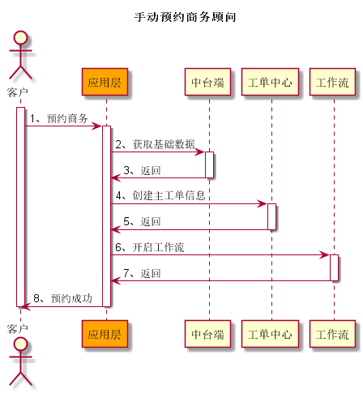
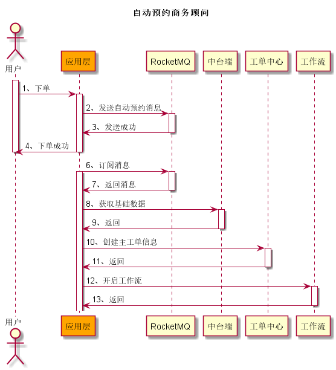

# 新协同改造详细方案汇总

一、**主要实现功能点**

- 任务之间的关联关系由任务模板来实现。
- 任务组之间的关联关系由工作流来实现。
- 任务模板可实现的功能：
  - 任务名称
  - 任务类型
  - 任务处理 action
  - 任务跳转的业务 url

二、**新车下单流程**

1、手动预约商务顾问

2、自动预约商务顾问

三、**类图设计**

四、**数据库设计**
