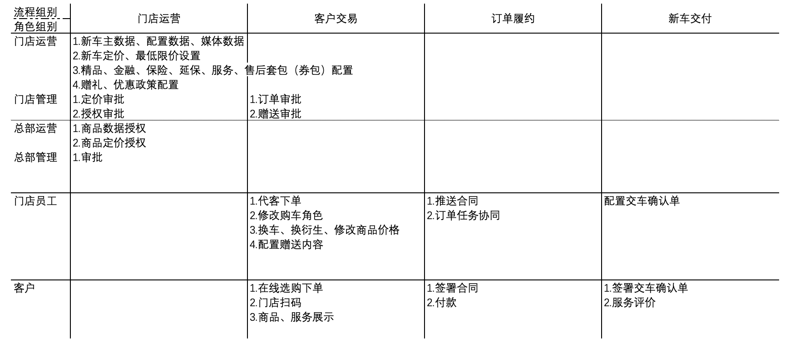
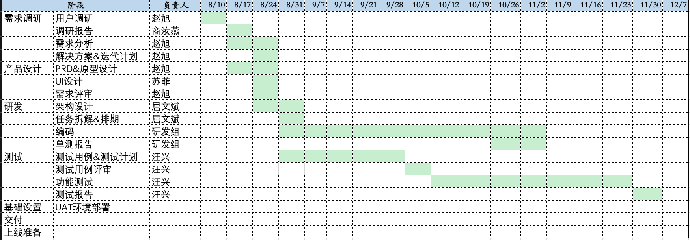

# 整车销售

## 2019-08-09

- 在之前老板给咱们组定了一个目标，第一步两家奥迪新车销售业务覆盖 100%，后面涉及到的问题可能会有几个：
  - 1.购车客户包含外籍人士、企业账号，包括订单过程中的指标修改
  - 2.订单过程中涉及到修改商品、修改价格（待定）、赠送卡券、精品业务场景
  - 3.商品类型的覆盖度问题，包含单独精品、延保服务、卡券等
- 初步工作计划沟通

  

- 初步排期

  
