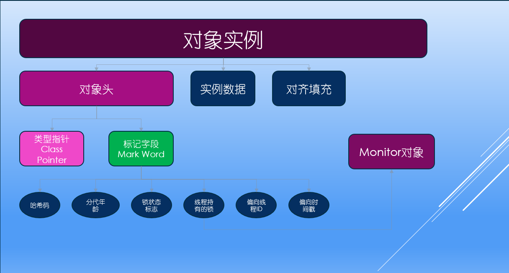

# synchronized 的底层实现

## 一、synchronized 问题点

- synchronized 的底层实现原理
- synchronized 锁与 JVM 的关系
- synchronized 的锁升级顺序
- synchronized 的锁优劣势与应用场景

## 二、synchronized 的使用方式

- **修饰实例方法**：作用于当前实例加锁
- **修饰静态方法**：作用于当前类对象加锁
- **修饰代码块**：指定加锁对象，对给定对象加锁

## 三、synchronized 的底层实现

