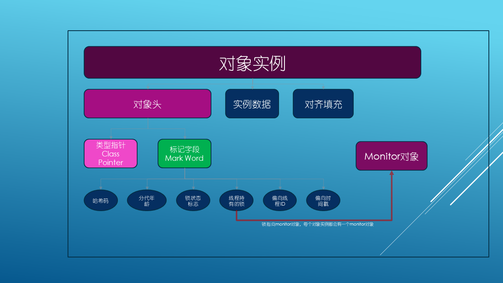

# synchronized 的底层实现

## 一、synchronized 问题点

- synchronized 的底层实现原理
- synchronized 锁与 JVM 的关系
- synchronized 的锁升级顺序
- synchronized 的锁优劣势与应用场景

## 二、synchronized 的使用方式

- **修饰实例方法**：作用于当前实例加锁
- **修饰静态方法**：作用于当前类对象加锁
- **修饰代码块**：指定加锁对象，对给定对象加锁

## 三、synchronized 的底层实现

- JVM 内的对象实例

  

- Monitor 监视器

  - 每个对象或者class字节都拥有一个monitor监视器
  
  

  - **Contention List**：所有请求锁的线程将被首先放置到该竞争队列
  - **Entry List**：Contention List 中那些有资格成为候选人的线程被移到 Entry List
  - **Wait Set**：那些调用 wait 方法被阻塞的线程被放置到 Wait Set
  - **OnDeck**：任何时刻最多只能有一个线程正在竞争锁，该线程称为 OnDeck
  - **Owner**：获得锁的线程称为 Owner
  - **!Owner**：释放锁的线程

- 锁升级流程

  

  - **偏向锁**

    - 偏向锁是 JDK6 中引入的一项锁优化，大多数情况下，锁不仅不存在多线程竞争，而且总是由同一线程多次获得，为了让线程获得锁的代价更低而引入了偏向锁。

    - 偏向锁会偏向于第一个获得它的线程，如果在接下来的执行过程中，该锁没有被其他的线程获取，则持有偏向锁的线程将永远不需要同步。

  - **轻量级锁**

    - 如果明显存在其它线程申请锁，那么偏向锁将很快升级为轻量级锁。

  - **自旋锁**

    - 自旋锁原理非常简单，如果持有锁的线程能在很短时间内释放锁资源，那么那些等待竞争锁的线程就不需要做内核态和用户态之间的切换进入阻塞挂起状态，它们只需要等一等（自旋），等持有锁的线程释放锁后即可立即获取锁，这样就避免用户线程和内核的切换的消耗。

  - **重量级锁**
    - 指的是原始的 Synchronized 的实现，重量级锁的特点：其他线程试图获取锁时，都会被阻塞，只有持有锁的线程释放锁之后才会唤醒这些线程。
