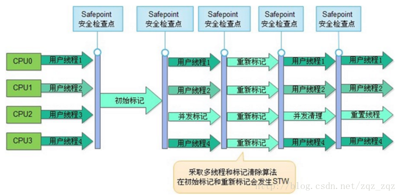
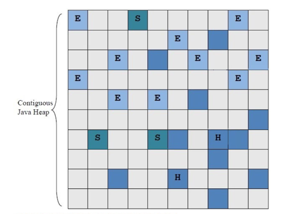
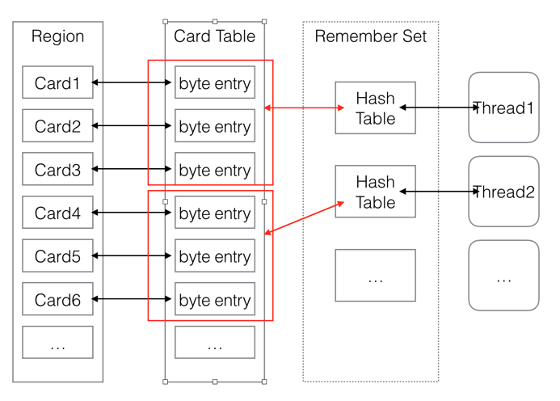
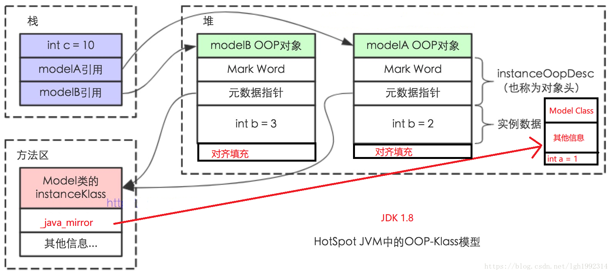
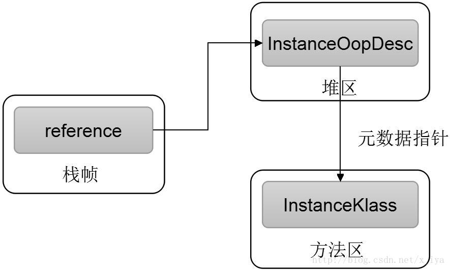

# jvm 详解

## 一、GC 垃圾回收算法

### 1、GC 算法

- 对象可达性
  - 对于对象的存活性，一种是使用引用计数的方法，即为每个对象都维护一个引用计数，每次该对象被引用一次则递增，使用完毕则递减，当引用计数为 0 时，则表示该对象不再被引用，可以被回收；
  - 另外一种是基于对象可达性分析来确定，Hotspot 虚拟机在进行垃圾回收时就是基于对象可达性分析来确定哪些对象是可以被回收的。
  - GC roots：对象可达性分析首先需要确定一个分析的起点，即 GC root 根节点对象。对于任何一个对象，判断是否存在一条从 GC root 可达的路径，即某个对象被 GC roots 对象自身直接引用或者间接引用，如果存在，则说明该对象是可达的，在本次 GC 中不能被回收，否则可以被回收。成为 GC roots 的对象首先在 JVM 的内存模型当中是使用堆外的对象，即方法区和栈中的对象来担当的，而不能是存放在堆自身的对象，因为 GC roots 对象是不使用垃圾收集器来回收的，如栈的对象引用是在出栈时被自动销毁的。主要包括以下：
    - 栈（或者说栈帧）中的对象引用：当前被执行的方法的对象类型的参数、局部变量，中间变量对应的对象引用；
    - JNI 本地方法栈中引用的对象，即 JVM 自身的方法的对象引用；
    - 方法区中的静态和常量对象引用：类的 static 静态属性的对象引用，类的常量的对象引用。

### 2、垃圾回收器组合

| 年轻代                 | 老年代       | JVM Option                                |
| ---------------------- | ------------ | ----------------------------------------- |
| Serial                 | Serial       | -XX:+UseSerialGC                          |
| Parallel Scavenge      | Serial       | -XX:+UseParallelGC -XX:-UseParallelGC     |
| Parallel Scavenge      | Parallel Old | -XX:+UseParallelGC -XX:+UseParallelOld    |
| Parallel New 或 Serial | CMS          | -XX:+UserParNewGC -XX:+UseConcMarkSweepGC |
| G1                     | G1           | -XX:+UseG1GC                              |
|                        |              |                                           |

- 垃圾回收器从线程运行情况分类有三种

  - 串行回收，Serial 回收器，单线程回收，全程 stw
  - 并行回收，名称以 Parallel 开头的回收器，多线程回收，全程 stw
  - CMS 与 G1，多线程分阶段回收，只有某阶段会 stw

- CMS 垃圾回收器

  - **CMS 垃圾回收特点**
    - CMS 只会回收老年代和永久带（1.8 开始为元数据区，需要设置 CMSClassUnloadingEnabled），不会收集年轻带
    - CMS 是一种预处理垃圾回收器，它不能等到 old 内存用尽时回收，需要在内存用尽前，完成回收操作，否则会导致并发回收失败；所以 cms 垃圾回收器开始执行回收操作，有一个触发阈值，默认是老年代或永久带达到 92%
  - CMS 处理过程有七个步骤

    - 初始标记(CMS-initial-mark) ,会导致 stw
    - 并发标记(CMS-concurrent-mark)，与用户线程同时运行
    - 预清理（CMS-concurrent-preclean），与用户线程同时运行
    - 可被终止的预清理（CMS-concurrent-abortable-preclean） 与用户线程同时运行
    - 重新标记(CMS-remark) ，会导致 stw
    - 并发清除(CMS-concurrent-sweep)，与用户线程同时运行
    - 并发重置状态等待下次 CMS 的触发(CMS-concurrent-reset)，与用户线程同时运行

    

- G1 垃圾回收器

  - 数据结构

    - Heap Region

      - 2048 个 region
      - 大小相同
      - 大小在 1~32MB 之间，取决于堆的大小
      - region 的类型

        - yong
        - old
        - Humongous

          - 所谓的 Humongous，就是一个对象的大小超过了某一个阈值——HotSpot 中是 Region 的 1/2，那么它会被标记为 Humongous

          

        - 其中 E 代表的是 Eden，S 代表的是 Survivor，H 代表的是 Humongous，剩余的深蓝色代表的是 Old（或者 Tenured），灰色的代表的是空闲的 region。

    - Remember Set

      - Card Table

        

      - 图中 RS 的虚线表名的是，RS 并不是一个和 Card Table 独立的，不同的数据结构，而是指 RS 是一个概念模型。实际上，Card Table 是 RS 的一种实现方式。

    - Collect Set
      - Collect Set(CSet)是指，在 Evacuation 阶段，由 G1 垃圾回收器选择的待回收的 Region 集合。G1 垃圾回收器的软实时的特性就是通过 CSet 的选择来实现的。
      - CSet 的选择可以分成两种
        - 在 fully-young generational mode 下：顾名思义，该模式下 CSet 将只包含 young 的 Region。G1 将调整 young 的 Region 的数量来匹配软实时的目标；
        - 在 partially-young mode 下：该模式会选择所有的 young region，并且选择一部分的 old region。old region 的选择将依据在 Marking cycle phase 中对存活对象的计数。G1 选择存活对象最少的 Region 进行回收。

- ZGC 垃圾回收器

  - 为什么需要新 GC 呢？毕竟 Java 10 已经有四种发布多年的垃圾收集器，并且几乎都是无限可调的。 换个角度看，G1 是 2006 年时引入 Hotspot VM 的。当时最大的 AWS 实例有 1 vCPU 和 1.7GB 内存，而今天 AWS 很乐意租给你一个 x1e.32xlarge 实例，该类型实例有 128 个 vCPU 和 3,904GB 内存。 ZGC 的设计目标是：支持 TB 级内存容量，暂停时间低（<10ms），对整个程序吞吐量的影响小于 15%。 将来还可以扩展实现机制，以支持不少令人兴奋的功能，例如多层堆（即热对象置于 DRAM 和冷对象置于 NVMe 闪存），或压缩堆

  - 着色指针

  - 读屏障

## 二、调优参数

- 调优的主要目的

  - 占用内存、延迟、吞吐量
  - 减少 FULL GC
  - 尽量使用效率高的 GC 回收算法

- 调优的工具

  - Jconsole

  - VisualVM

## 三、hotspat 的实现

### 1、oop(Ordinary Object Pointer)/klass



### 2、instanceOopDesc 与 instanceKlass



### 3、JVM 中，InstanceKlass、java.lang.Class 的关系

- ClassFileParser 将 class 文件在 runtime 解析成一个个 InstanceKlass 对象，这个对象是静态字节码文件在运行时 Metaspace 空间的一个映射。我们知道 Java 是一种支持反射的语言，为了能在 Java 层实现对定义类型的解构，JVM 实现了 InstanceKlass 的一个 java mirror 的概念——java.lang.Class 对象。
  InstanceKlass 类继承自 Klass 类，在 Klass 类中有一个成员变量，并且提供了相应的 Setter/Getter 函数实现：

  ```java mirror
  // java/lang/Class instance mirroring this class
  oop       _java_mirror;
  oop java_mirror() const              { return _java_mirror; }
  void set_java_mirror(oop m) { klass_oop_store(&_java_mirror, m); }
  ```

### 4、反射

- Class 类所提供的反射机制，最终都是通过 JNI 接口，调用相应的 native 方法，然后通过 as_Klass 函数转换成 InstanceKlass 对象,拿到定义类型的元数据信息的。

- 在 java_lang_Class 类中，也提供了 Class 对象与 Klass 对象的转化函数：

  ```java_lang_Class
  static Klass* as_Klass(oop java_class);
  static void set_klass(oop java_class, Klass* klass);
  ```

### 5、方法调用

- java 是一种半编译半解释型语言，也就是 class 文件会被解释成机器码，而方法调用也会被解释成具体的方法调用指令，大致可以分为以下五类指令：

  - invokestatic：调用静态方法；
  - invokespecial：调用实例构造方法，私有方法和父类方法；
  - invokevirtual：调用虚方法；
  - invokeinterface：调用接口方法，在运行时再确定一个实现此接口的对象；
  - invokedynamic：在运行时动态解析出调用点限定符所引用的方法之后，调用该方法；
    - 注意：invokedynamic 指令是 jdk1.7 才加入的，但是在 jdk1.7 中并没有开始使用。在 jdk1.8 中才开始大量使用，主要就是我们大量用的 lambda 表达式。
  - 总结：
    - 如果在编译时期解析，那么指令指向的方法就是静态绑定，也就是 private，final，static 和构造方法，也就是上面的 invokestatic 和 invokespecial 指令，这些在编译器已经确定具体指向的方法。而接口和虚方法调用无法找到真正需要调用的方法，因为它可能是定义在子类中的方法，所以这种在运行时期才能明确类型的方法我们成为动态绑定。

- 方法表

  - 针对方法调用动态分派的过程，虚拟机会在类的方法区建立一个虚拟方法表的数据结构(virtual method table,vtable),
  - 针对于 invokeinterface 指令来说，虚拟机会建立一个叫做接口方法表的数据结构(interface method table,itable)

    - 方法表会在类的连接阶段初始化，方法表存储的是该类方法入口的一个映射，比如父类的方法 A 的索引号是 1，方法 B 的索引号是 2。。。
      如果子类继承了父类，但是某个父类的方法没有被子类重写，那么在子类的方法表里边该方法指向的是父类的方法的入口，子类并不会重新生成一个方法，然后让方法表去指向这个生成的，这样做是没有意义的。还有一点，如果子类重写了父类的方法，那么子类这个被重写的方法的索引和父类的该方法的索引是一致。比如父类
      A 的 test 方法被子类 C 重写了，那么子类 C 的 test 方法的索引和父类 A 的 test 方法的索引都是 1（打个比方），这样做的目的是为了快速查找，比如说在子类里边找不到一个方法索引为 1 的方法，那么 jvm 会直接去父类查找方法索引为 1 的方法，不需要重新在父类里边遍历。

## 四、参考资料

- [JVM 调优总结](https://www.cnblogs.com/andy-zhou/p/5327288.html)
- [CMS 垃圾回收器详解](https://blog.csdn.net/zqz_zqz/article/details/70568819)
- [G1 垃圾回收器详解](https://www.jianshu.com/p/aef0f4765098)
- [一文读懂 Java 11 的 ZGC 为何如此高效](https://mp.weixin.qq.com/s/nAjPKSj6rqB_eaqWtoJsgw)
- [HotSpot Oop/Klass 模型](https://blog.csdn.net/x_iya/article/details/78873923)
- [JVM 源码分析之安全点 safepoint](https://www.jianshu.com/p/c79c5e02ebe6)
- [Java | JVM 虚方法调用那些事](https://blog.csdn.net/woshilijiuyi/article/details/81366615)
- [openJDK 源码下载](http://hg.openjdk.java.net/)
- [某大型跨境电商 JVM 调优总结](https://www.cnblogs.com/shoshana-kong/p/10575923.html)
- [一次线上 JVM 调优实践](https://blog.csdn.net/cml_blog/article/details/81057966)
