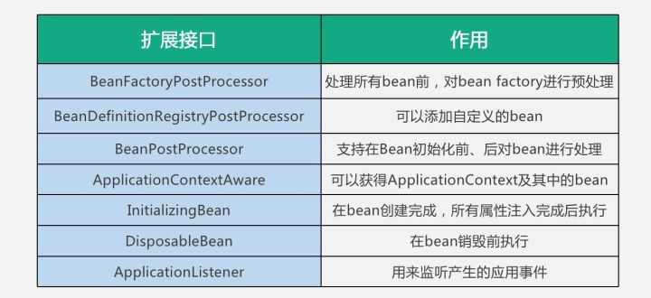
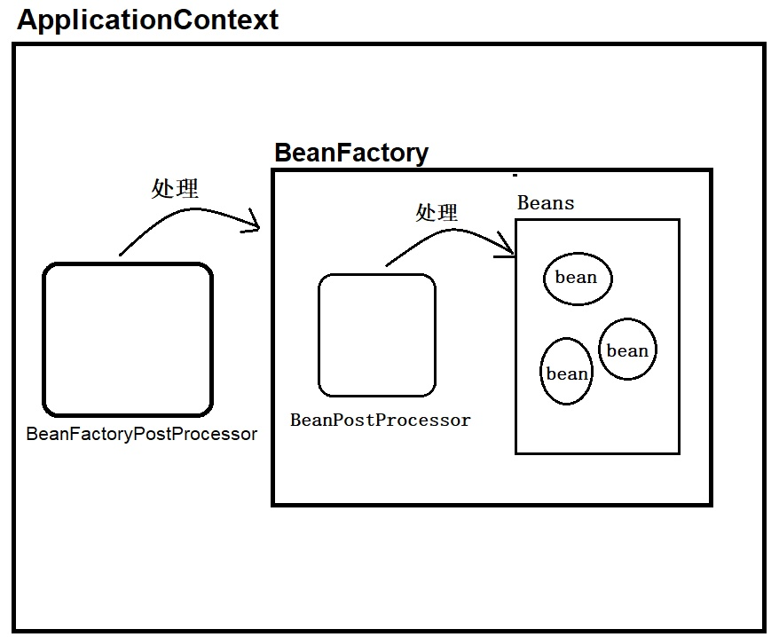

# spring 详解

## 主要内容

- 盲点

  - BeanDefinition
  - BeanPostProcesser

- Spring 说，万物皆可定义

- 默默付出的后置处理器

  - 扩展点
    

  - 后置处理方式
    

- 利用后置处理器返回代理对象

- 利用@Import 注册 bean
  - ImportSelector
    - ConfigurationClassParser.processImports
      - 在这里我们可以看到 ImportSelector 接口的返回值会递归进行解析，把解析到的类全名按照@Configuration 进行处理
  - DeferredImportSelector
  - ImportBeanDefinitionRegistrar

## spring boot

- AutoConfiguration

  ```AutoConfiguration
  # Auto Configure
  org.springframework.boot.autoconfigure.EnableAutoConfiguration=\
  org.mybatis.spring.boot.autoconfigure.MybatisAutoConfiguration
  ```

- starter

## 参考资料

- [怎么回答面试官：你对 Spring 的理解？](https://www.zhihu.com/question/48427693/answer/723146648?hb_wx_block=0&utm_source=wechat_session&utm_medium=social&utm_oi=636935036985806848)
- [深入理解 Spring 的 ImportSelector 接口](https://www.cnblogs.com/niechen/p/9262452.html)
