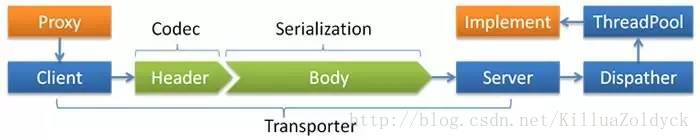
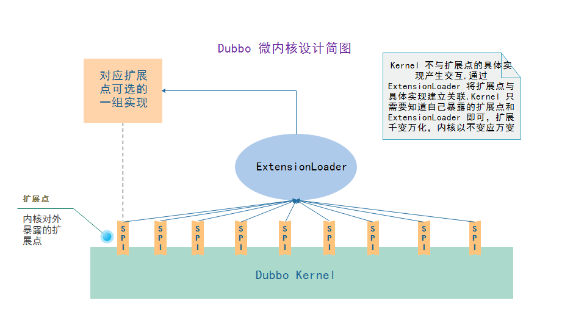
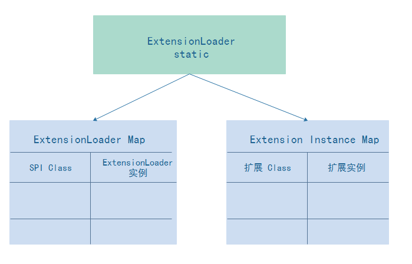
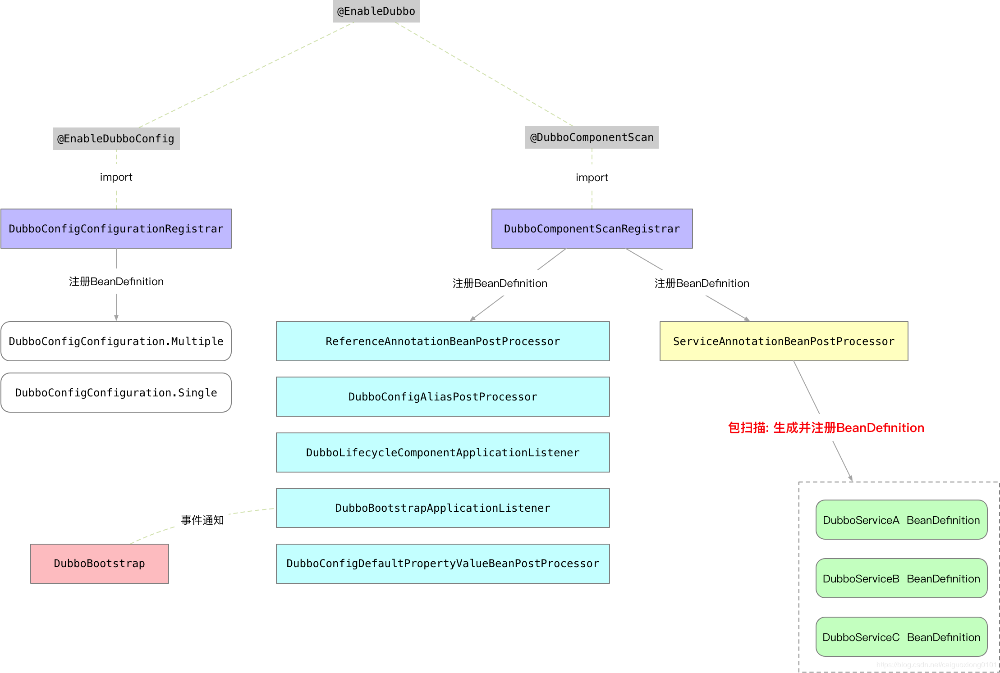
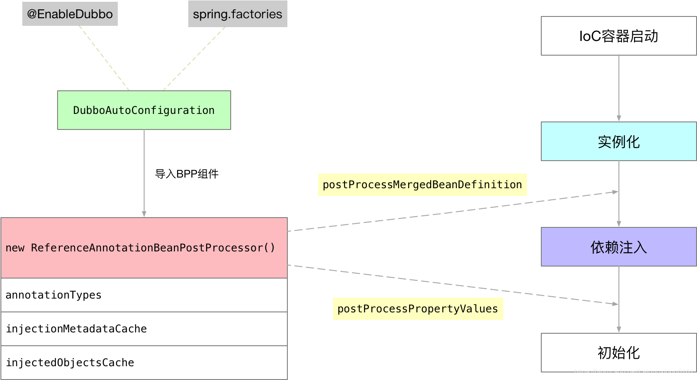

# dubbo

## RPC 的一些感想

- HTTP 是通信协议，RPC 是一种设计实现框架。
- RPC 中使用的通信协议大都是长连接，不需要每次经过 3 次握手。
- RPC 中使用的通信协议大都自己设计，没有通用标准。
- RPC 框架基本都围绕通信协议、传输协议、线程模型展开。
- 分布式不是 RPC 的必要特性。

## 一、dubbo框架

### 1、dubbo-remoting

- remoting调用图

  

### 2、dubbo 的微内核设计

- 根据我个人对 Dubbo 微内核设计的理解，以及阅读源码后总结。视觉总是最直观的，可以让大脑最快速度的有一个最直观的认识，一开始就一头深入到源码的细节中只会让人迷糊。不理解 Dubbo 的微内核设计架构的话，学习起来会走不少弯路

  

  - @SPI

    - @SPI 注解标识了接口是一个扩展点 ， 属性 value 用来指定默认适配扩展点的名称

  - @Adaptive

    - @Adaptive 注解在类上 ， 这个类就是缺省的适配扩展。
    - @Adaptive 注解在扩展点 Interface 的方法上时 ， dubbo 动态的生成一个这个扩展点的适配扩展类（生成代码 ，动态编译实例化 Class ），名称为 扩展点 Interface 的简单类名 + $Adaptive ，例如 ： ProxyFactory$Adpative 。这么做的目的是为了在运行时去适配不同的扩展实例 ， 在运行时通过传入的 URL 类型的参数或者内部含有获取 URL 方法的参数 ，从 URL 中获取到要使用的扩展类的名称 ，再去根据名称加载对应的扩展实例 ，用这个扩展实例对象调用相同的方法 。如果运行时没有适配到运行的扩展实例 ， 那么就使用 @SPI 注解缺省指定的扩展。通过这种方式就实现了运行时去适配到对应的扩展。

  - @Activate

    - @Activate 注解在扩展点的实现类上 ，表示这一个扩展类被获取到的的条件，符合条件就被获取，不符合条件就不获取 ，根据 @Activate 中的 group 、 value 属性来过滤 。具体参考 ExtensionLoader 中的 getActivateExtension 函数。

  - **ExtensionLoader**-扩展加载器

    - 扩展加载器绝对是一个核心组件了 ，它控制着 dubbo 内部所有扩展点的初始化、加载扩展的过程。这个类的源码是很有必要深入学习的。从 Dubbo 内核设计简图可以看到，现在的学习还没有接触到 dubbo 的内核。

      

### 3、dubbo-filter

- Cunsumer-服务订阅方

  - ConsumerContextFilter
    - 默认触发
  - ActiveLimitFilter
    - 客户端限流
  - FutureFilter
    - oninvoke 在方法调用前触发（如果调用出现异常则会直接触发 onthrow 方法）
    - onreturn 在方法返回会触发（如果调用出现异常则会直接触发 onthrow 方法）
    - onthrow 调用出现异常时候触发

- Provider-服务提供方

  - ContextFilter
    - ContextFilter 和 ConsumerContextFilter 是结合使用的
  - EchoFilter
    - 回响测试主要用来检测服务是否正常（网络状态），单纯的检测网络情况的话其实不需要执行真正的业务逻辑的，所以通过 Filter 验证一下即可.
  - ExecuteLimitFilter
    - 服务端接口限制限流的具体执行逻辑就是在 ExecuteLimitFilter 中，因为服务端不需要考虑重试等待逻辑，一旦当前执行的线程数量大于指定数量，就直接返回失败了，所以实现逻辑相对于 ActiveLimitFilter 倒是简便了不少。
  - ExceptionFilter
    - 如果是 checked 异常则直接抛出
    - 如果是 unchecked 异常但是在接口上有声明，也会直接抛出
    - 如果异常类和接口类在同一 jar 包里，直接抛出
    - 如果是 JDK 自带的异常，直接抛出
    - 如果是 Dubbo 的异常，直接抛出
    - 其余的都包装成 RuntimeException 然后抛出（避免异常在 Client 出不能反序列化问题）

### 4、参考资料

- [dubbo 源码](https://github.com/apache/dubbo)
- [dubbo 官方文档](http://dubbo.apache.org/zh-cn/index.html)
- [dubbo 原理和源码解读](https://github.com/cyfonly/dubbo-read)
- [dubbo-spring 项目](https://github.com/apache/dubbo-spring-boot-project)
- [dubbo 实现原理简单介绍](https://www.cnblogs.com/steven520213/p/7606598.html)
- [dubbo 源码分析 之 Listener & Filter](https://www.jianshu.com/p/a6d2bc60bd0e)
- [Dubbo 如何成为连接异构微服务体系的最佳服务开发框架](https://mp.weixin.qq.com/s/-fvDeGlCLjz0n60naZJnQg)

## 二、dubbo与spring的整合

### 1、与spring boot的整合（dubbo-spring-boot-starter）

- DubboConfigBindingsRegistrar

### 2、与spring mvc的整合（dubbo-spring-config）

- #### a、基于xml格式

  - dubbo.xsd
  - spring.schemas
  - spring.handlers
  - DubboNamespaceHandler 类
  - ServiceBean
  - ReferenceBean
  - DubboBeanDefinitionParser

- #### b、基于注解模式（@EnableDubbo）

  - provider端

    

  - consumer端
  
    

### 3、参与资料

- [Spring Boot整合Dubbo Provider](https://blog.csdn.net/caiguoxiong0101/article/details/105919366/)
- [Spring Boot整合Dubbo Consumer](https://blog.csdn.net/caiguoxiong0101/article/details/105900199)
