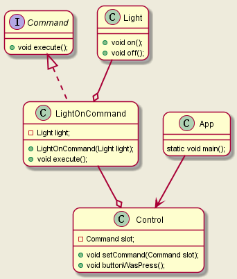

# 设计模式

## 一、设计原则

- 找出应用中可能需要变化之处，把它们独立出来，不要和那些不需要变化的代码混在一起
- 针对接口编程，而不是针对实现编程
- 多用组合，少用继承

## 二、行为模式

### 1、命令模式

- 不同的对象做不同的事

  

### 2、策略模式

- 不同的算法做同样的事

### 3、适配器模式

- 将一个类的接口，转换成客户期望的另一个接口，适配器让原本接口不兼容的类可以合作无间

- 对象适配器

- 类适配器

### 4、装饰者模式

- 动态的装责任附加到对象上，若要扩展功能，装饰者提供了比继承更有弹性的替代方案。

  
