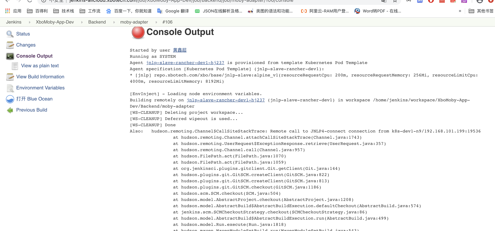
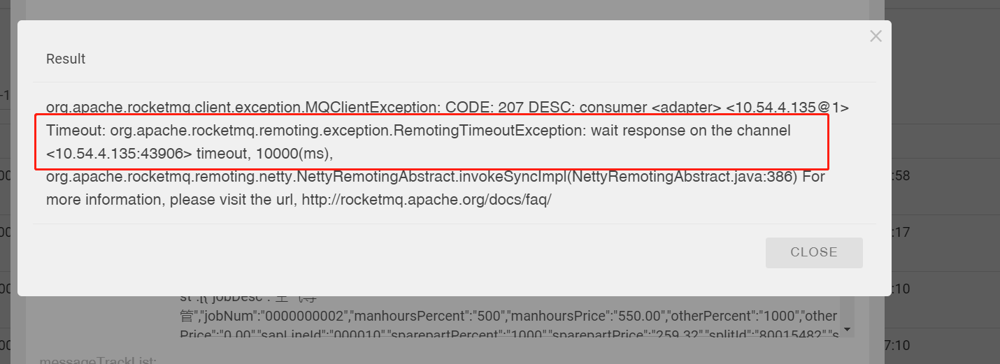

# 问题汇总

## dev环境

- jenkins问题-issue1
  - 原因：dev资源不足
    
  - 解决方案：把测试与开发的pod分开

- rocket客户端连接-issue3
  - 原因：未定
    
  - 解决方案：把测试与开发的pod分开

## uat环境

## prd环境

- mysql读库磁盘满-issue2
  - 原因：初步判断数据中心job问题（待验证）
  
  - 解决方案：迁出数据中心库，不与业务揉在一起
