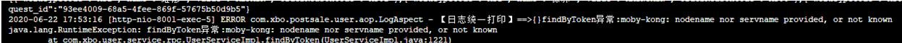
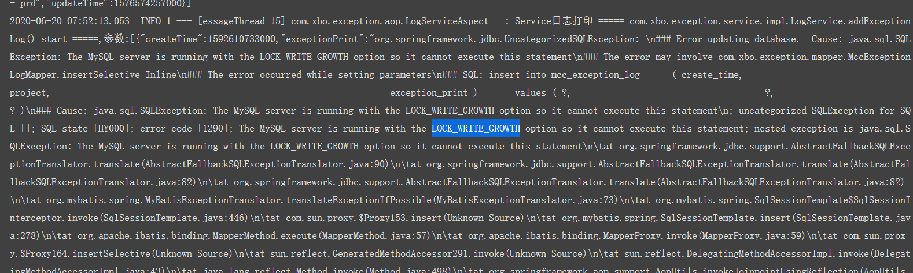

# 问题汇总

## dev环境

- jenkins问题-issue1
  - 描述：jenkins的dev环境构建失败
    
  - 原因：dev资源不足，每个
  - 解决方案：把测试与开发的pod分开

- rocket客户端连接-issue3
  - 描述：客户端链接不上mq服务器
    
  - 原因：未定
  - 解决方案：

- nexus问题-issue4
  - 描述：包拉不下来
    
  - 原因：
  - 解决方案：

- coredns解析问题-issue5
  - 描述：findByToken异常:moby-kong: nodename nor servname provided, or not known
    
  - 原因：与DNS服务器通信超时
  - 解决方案：  

## uat环境

## prd环境

- mysql读库磁盘满-issue2
  - 描述：更新与插入数据语句执行失败
    
  - 原因：初步判断数据中心job问题（待验证）
  - 解决方案：迁出数据中心库，不与业务揉在一起
