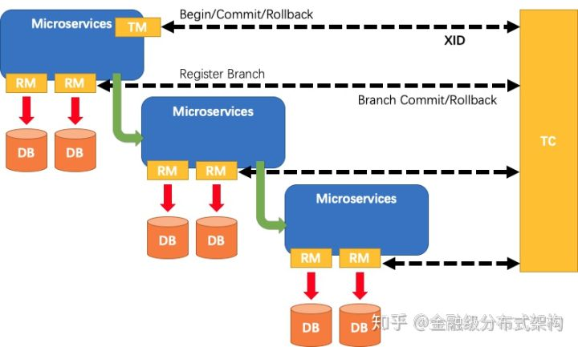
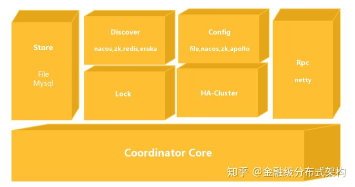

# **分布式事务（<font color=red>GTS</font>）**

## **一、seata 的过程模型**



- TC：事物的协调者。也可以看做是<font color=red>**seata-server**</font>，用于我们接收事务的注册、提交和回滚。

  - 协调者应该具备的能力
    - 正确的协调：能正确的协调 RM 和 TM 接下来应该做什么，做错了应该怎么办，做对了应该怎么办。
    - 高可用：事务协调器在分布式事务中很重要，如果不能保证高可用，那么他也没有存在的必要了。
    - 高性能：事务协调器的性能一定要高，如果事务协调器性能有瓶颈，那么他所管理的 RM 和 TM 会经常遇到超时，从而引起回滚频繁。
    - 高扩展性：这个特点是属于代码层面的，如果是一个优秀的框架，那么需要给使用方很多自定义扩展，比如服务注册/发现，读取配置等等。

- TM：事务的发起者。用来告诉 TC，全局事务的开始、提交、回滚。

- RM：具体的事务资源，每一个 RM 都会作为一个分支事务的注册、提交、回滚。

## **二、seata-server**



### Seata-Server 整体的模块图如上所示：

- Coordinator Core：最下面的模块是事务协调器核心代码，主要用来处理事务协调的逻辑，如是否 Commit、Rollback 等协调活动。
- Store：存储模块，用来将我们的数据持久化，防止重启或者宕机数据丢失。
- Discover：服务注册/发现模块，用于将 Server 地址暴露给 Client。
- Config：用来存储和查找服务端的配置。
- Lock：锁模块，用于给 Seata 提供全局锁的功能。
- Rpc：用于和其他端通信。
- HA-Cluster：高可用集群，目前还没开源。为 Seata 提供可靠的高可用功能。

## **三、examples 部署**

- 开启服务注册中心

  - 支持的组件有：nacos、eureka、zk、apollo
  - 此处我们选择阿里开源的服务注册中心<font color=red>**nacos**</font>
  - sh startup.sh -m standalone (以单例方式开启 nacos)

- 开启 seata-server 服务（修改 mysql、nacos 配置）

  - seata-server 服务[releases 地址](https://github.com/seata/seata/releases)

    ```
    sh seata-server.sh $LISTEN_PORT $STORE_MODE

    e.g.

    sh seata-server.sh 8091 file
    ```

- seata-samples 示例
  - github 地址：https://github.com/seata/seata-samples.git

## **四、seata-server 代码解析**
