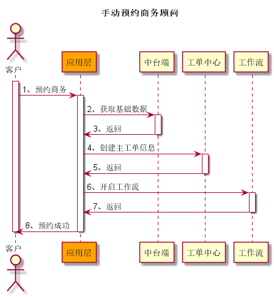
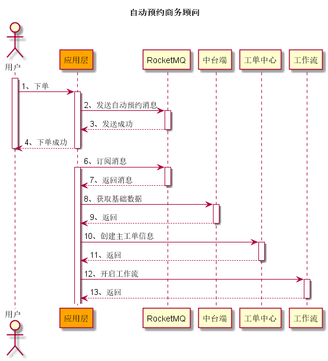
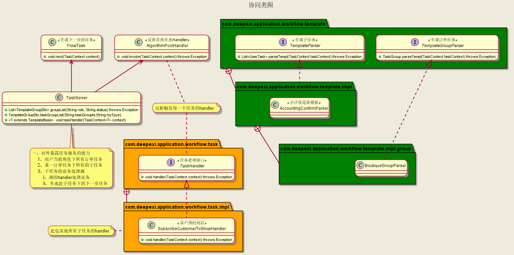
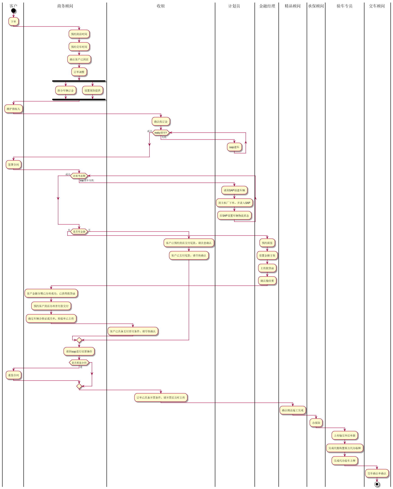

# 新协同改造详细方案汇总

一、**主要实现功能点**

- 工作流维护管理各角色之间工作的协作
  - 串联了工作人员之间的关联关系
- 协同管理角色每个工作的任务组合
  - 串联工作人员自己工作的顺序组合
  - 任务组内的任务可以灵活组合
  - 每个任务有对应的模板配置
  - 任务模板包含：
    - 任务 title
    - 任务对应处理的 handler
    - 是否要触发其它角色的工作

二、**新车下单流程**

1、手动预约商务顾问

2、自动预约商务顾问

三、**类图设计**

四、**协同流程**

五、**数据库设计**

六、**模板设计规范**

七、**已知缺陷**
