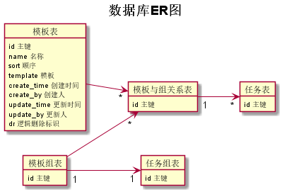

# 新协同改造详细方案汇总

一、**主要实现功能点**

- 通过与工作流结合实现以上功能
- 订单任务结点由工作流触发激活
- 当订单任务结点激活后，生成此任务下的所有子任务
- 把每个任务的处理方法拆分成单独的action
- 每个模板的处理逻辑可以灵活配置

二、**新车下单流程**

1、手动预约商务顾问

2、自动预约商务顾问

三、**类图设计**

四、**协同流程**

五、**数据库设计**

六、**模板设计规范**

七、**已知缺陷**
